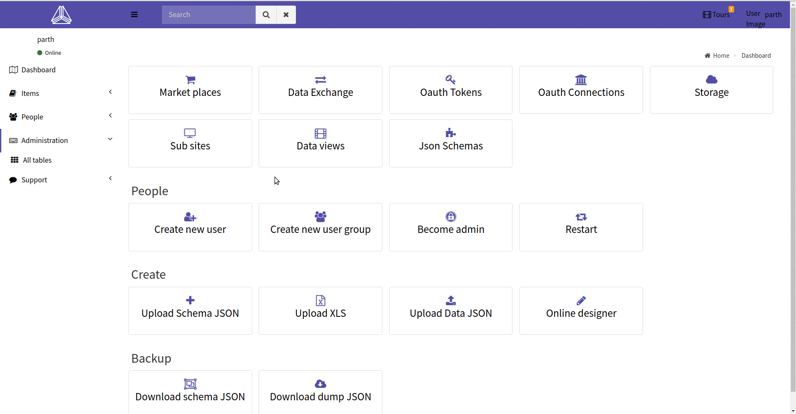

# State tracking for entities

Tracking the status of things is one of the most common operation in most business flows. Daptin has a native support for state tracking and allows a lot of convienent features.

## State machine

A state machine is a description of "states" which the object can be in, and list of all valid transactions from one state to another. Lets begin with an example:

The following JSON defines a state machine which has (a hypothetical state machine for tracking todos):

- Initial state: to_be_done
- List of valid states: to_be_done, delayed, started, ongoing, interrupted, completed
- List of valid transitions, giving name to each event

```json
		{
        "Name": "task_status",
        "Label": "Task Status",
        "InitialState": "to_be_done",
        "Events": [{
                "Name": "start",
                "Label": "Start",
                "Src": [
                    "to_be_done",
                    "delayed"
                ],
                "Dst": "started"
            },
            {
                "Name": "delayed",
                "Label": "Unable to pick up",
                "Src": [
                    "to_be_done"
                ],
                "Dst": "delayed"
            },
            {
                "Name": "ongoing",
                "Label": "Record progress",
                "Src": [
                    "started",
                    "ongoing"
                ],
                "Dst": "ongoing"
            },
            {
                "Name": "interrupted",
                "Label": "Interrupted",
                "Src": [
                    "started",
                    "ongoing"
                ],
                "Dst": "interrupted"
            },
            {
                "Name": "resume",
                "Label": "Resume from interruption",
                "Src": [
                    "interrupted"
                ],
                "Dst": "ongoing"
            },
            {
                "Name": "completed",
                "Label": "Mark as completed",
                "Src": [
                    "ongoing",
                    "started"
                ],
                "Dst": "completed"
            }
        ]
    }

```

State machines can be uploaded to Daptin just like entities and actions. A JSON/YAML file with a ```StateMachineDescriptions``` top level key can contain an array of state machine descriptions.


## Enabling state tracking for entity

First we need to tell goms that an entity is trackable. To do this, go to the world table page and edit the corresponding entity. Check the "Is state tracking enabled" checkbox.

This "is_state_tracking_enabled" options tells daptin to create the associated state table for the entity. Even though we have not yet specified which state machines are available for this entity.

To make a state machine available for an entity, go to the "SMD" tab of the entity and add the state machine by searching it by name.

It would not make a lot of sense if the above state machine was allowed for all type of entities. Also since state of the objects in maintained in a separate table

