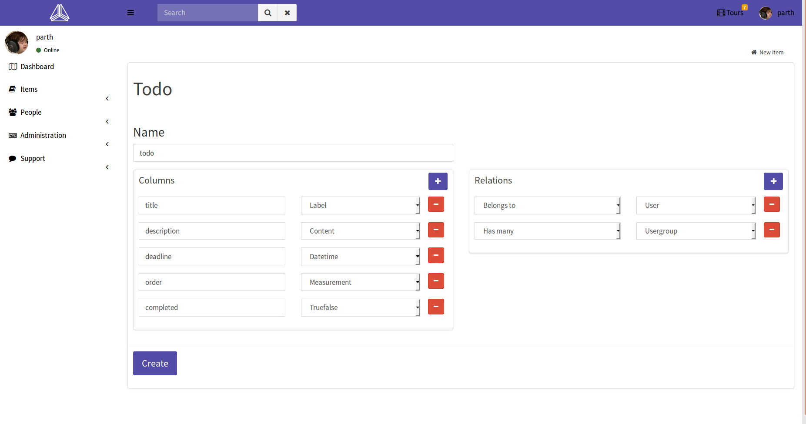

# Entites

Entities are the foundation for goms. Everything else in goms work on one or more entities. To define an entity, we specify the fields which belong to an entity and its relations with other entities. A collection of entities and their relations will be called a schema.


Lets imagine we were creating a todo application and wanted to track the follwing for each todo item
- the todo text - lets call this "title"
- a description - a longer text, which may or may not be empty
- a deadline date - a date field to capture the deadline
- completed - a true/false field, which captures if the todo is done
- order - a field to store the priority of each todo

Along with the fields mentioned above, we might want certain validations and conformations whenever we store a new todo

- title cannot be empty
- order has to be numeric

Once we have come up with the above picture in mind, we can use one of the following ways to tell goms about this:

# Online entity designer

The entity designer is accessible from dashboard using the "Online designer" button. Here you can set the name, add columns and relations and create it.



# Market place

Checkout [marketplace documentation](marketplace.md)

# JSON / YAML files

The JSON for our hypothetical todo entity will look as follows:

```json
    {
        "Tables": [{
            "TableName": "todo",
            "Columns": [{
                    "Name": "title",
                    "DataType": "varchar(500)",
                    "ColumnType": "label",
                    "IsIndexed": true
                },
                {
                    "Name": "completed",
                    "DataType": "int(1)",
                    "ColumnType": "truefalse",
                    "DefaultValue": "false"
                },
                {
                    "Name": "deadline",
                    "DataType": "date",
                    "ColumnType": "date",
                    "IsNullable": true
                },
                {
                    "Name": "order",
                    "ColumnName": "item_order",
                    "DataType": "int(4)",
                    "ColumnType": "measurement",
                    "DefaultValue": "10"
                },
                {
                    "Name": "text",
                    "DataType": "text",
                    "ColumnType": "content",
                    "IsNullable": true
                }
            ],
            "Conformations": [{
                "ColumnName": "order",
                "Tags": "numeric"
            }],
            "validations": [{
                "ColumnName": "title",
                "Tags": "required"
            }]
]}
```

While the same description in YAML will look as follows

```yaml
Tables:
- TableName: todo
  Columns:
  - Name: title
    DataType: varchar(500)
    ColumnType: label
    IsIndexed: true
  - Name: url
    DataType: varchar(200)
    ColumnType: url
    IsNullable: true
  - Name: completed
    DataType: int(1)
    ColumnType: truefalse
    DefaultValue: 'false'
  - Name: schedule
    DataType: date
    ColumnType: date
    IsNullable: true
  - Name: order
    ColumnName: item_order
    DataType: int(4)
    ColumnType: measurement
    DefaultValue: '10'
  - Name: text
    DataType: text
    ColumnType: content
    IsNullable: true
  Conformations:
  - ColumnName: order
    Tags: numeric
  Validations:
  - ColumnName: title
Tags: required
```

You can choose to work with either json or yaml. Once the schema is ready, it can be uploaded directly from goms dashboard.

### Column specifications

Columns of the entity can be cusomised:

	Name              string         `human readable name, can be skipped`
	ColumnName        string         `column name in the table`
	ColumnDescription string         `human readable description`
	ColumnType        string         `column type is a rich type of the column`
	IsIndexed         boolean        `true to add an index on this column`
	IsUnique          boolean        `true to set a unique constraint on this column`
	IsNullable        boolean        `are null values allowed`
	Permission        uint64          `permission column (check authorization docs)`
	DataType          string         `the column type inside the database`
	DefaultValue      string         `default value if any (has to be inside single quotes for static values`

### Column types

GoMS supports a variety of rich data types, which helps it to automatically make intelligent decisions and validations. Here is a list of all column types and what should they be used for

	 id:
		 an identity column, mostly for internal purposes
	 alias:
		 a foreign key column
	 date:
		 full date, no time
	 time:
		 time/time interval, no date
	 day:
		 day of the month - 1 to 31
	 month:
		 month of the year - 1 to 12
	 year:
		 Year
	 minute:
		 minute of the hour - 0 to 59
	 hour:
		 hour of the dat - 0 - 23
	 datetime:
		 date + time (not stored as timestamp, served at date time string)
	 email:
		 email
	 name:
		 column to be used as name of the entity
	 json:
		 JSON data
	 password:
		 password - are bcrypted with cost 11
	 value:
		 value is enumeration type
	 truefalse:
		 boolean
	 timestamp:
		 timestamp (stored as timestamp, served as timestamp)
	 location.latitude:
		 only latitude
	 location:
		 latitude + longitude in geoJson format
	 location.longitude:
		 only longitude
	 location.altitude:
		 only altitude
	 color:
		 hex color string (#ABCDE1)
	 rating.10:
		 rating on a scale of 10
	 measurement:
		 numeric column
	 label:
		 a label for the entity, similar to name but can be more than one
	 content:
		 larger contents - texts/html/json/yaml
	 file:
		 uploads, connect storage for using this
	 url:
		 Urls/links

### Validations

GoMS uses the excellent [go-playground/validator](https://github.com/go-playground/validator) library to extensive validations

It has the following unique features:

- Cross Field and Cross Struct validations by using validation tags or custom validators.
- Slice, Array and Map diving, which allows any or all levels of a multidimensional field to be validated.


### Conformations

Goms uses the excellent [leebenson/conform](https://github.com/leebenson/conform) library to apply conformations on data before storing them in the database

- Conform- keep user input in check (go, golang)
- Trim, sanitize, and modify struct string fields in place, based on tags.

Use it for names, e-mail addresses, URL slugs, or any other form field where formatting matters.

Conform doesn't attempt any kind of validation on your fields.

## Excel file upload

You can upload data from XLS. Goms will take care of going through your XLS file and identifying column types. This is one of the easiest and fastest ways to create entities and uploading data in goms. You can specify relations among entities later from the online designer.

## Restart

Goms relies on self restarts to configure new entities and apis. As soon as you upload a schema file, goms will write the file to disk, and restart itself. When it starts it will read the schema file, make appropriate changes to the database and expose JSON apis for the entities and actions.

You can issue a goms restart from the dashboard. Goms takes about 15 seconds approx to start up and configure everything.